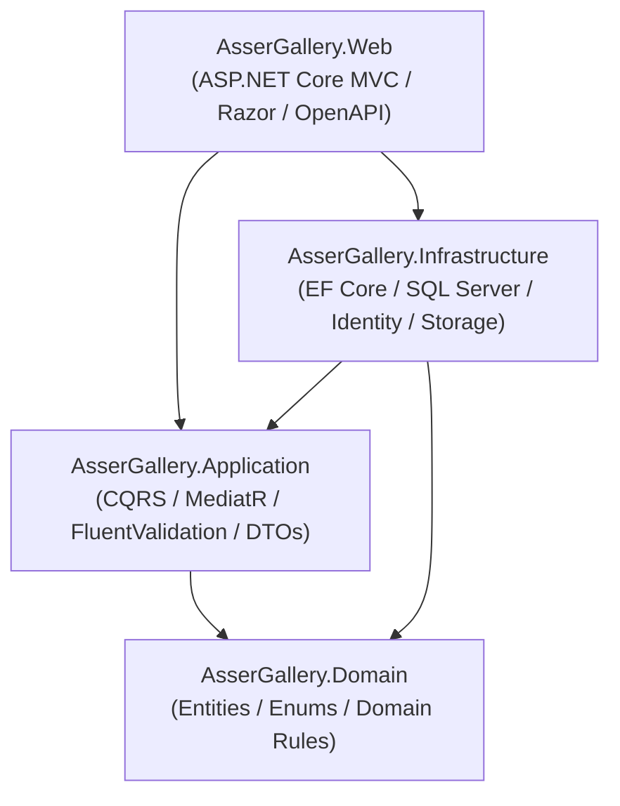

# Asser Gallery — Clothing Inventory, Sales & Business Operations Platform

[](https://dotnet.microsoft.com/)
[](https://blog.cleancoder.com/uncle-bob/2012/08/13/the-clean-architecture.html)
[](https://www.microsoft.com/sql-server)
[](https://www.docker.com/)
[](#-localization--theming)

**Asser Gallery** is a high-performance business management system and public clothing catalog built for apparel retailers transitioning from manual social-media sales (Facebook groups/pages, WhatsApp) to a centralized operational hub.

---

## 🌟 Key Features

- **🛍️ Mobile-First Public Catalog:**
  - Fast, responsive browsing with color-swatch pickers and discount tags.
  - Multi-criteria filtering by category, price, color, and stock availability.
  - **Original vs. AI-Enhanced image comparison** slider/toggle.
  - Direct 1-click **WhatsApp & Messenger deep-order links** prefilled with product details.
  - Direct customer callback / inquiry request submission.

- **📊 Admin Operations & Analytics:**
  - **KPI Dashboard:** Live revenue, total inventory count, expense breakdown, and net profit.
  - **Interactive Analytics (Chart.js):** Monthly revenue vs. expense trends, category distribution, and top-selling product metrics.
  - **Inventory Matrix:** Real-time quantity tracking per color variant with automatic stock status updates (*Available*, *Limited Stock*, *Out of Stock*).
  - **Sales & Orders Ledger:** Invoice generation, auto-deduction of inventory, and automatic revenue logging.
  - **Financial Ledger:** Income and expense tracking across categories (Stock Purchases, Packaging, Delivery, Ads, Revenue).
  - **Data Export & Reporting:** Instant UTF-8 BOM CSV/Excel export for Sales, Finances, and Inventory.
  - **Facebook Publishing Assistant:** Real Graph API publishing for Facebook Pages and quick-copy + direct group links for Facebook Groups.

- **🌐 Internationalization & UX:**
  - Native dual-language support (**Arabic** + **English**) with automatic **RTL / LTR** layout switching.
  - Persisted **Light / Dark mode** theming.

---

## 🏗️ Clean Architecture Layout



### Solution Structure

```
src/
├── AsserGallery.Domain/            # Enterprise business rules, entities, and enums
│   ├── Common/                     # Base entities and audit properties
│   ├── Entities/                   # Product, Variant, Color, Category, Sale, Finance, CustomerRequest
│   └── Enums/                      # ProductStatus, TransactionType, ImageType, ContactChannel
│
├── AsserGallery.Application/       # Application use cases, CQRS, validation & DTOs
│   ├── Common/                     # Interfaces (IApplicationDbContext, IImageStorageService), Behaviors
│   ├── Features/
│   │   ├── Categories/             # Category CQRS & validation
│   │   ├── CustomerRequests/       # Callback submission & admin management
│   │   ├── Dashboard/              # Summary KPI queries & Chart.js analytics calculations
│   │   ├── Facebook/               # Facebook page publishing & group assist helper
│   │   ├── Finances/               # Income/Expense ledger CQRS & CSV export
│   │   ├── Products/               # Product CRUD, variant stock tracking & CSV export
│   │   ├── Sales/                  # Order processing, stock deduction & CSV export
│   │   └── Settings/               # Store configuration settings
│   └── Mappers/                    # Manual static mapping extension methods
│
├── AsserGallery.Infrastructure/    # External concerns, database, identity, and persistence
│   ├── Identity/                   # ASP.NET Core Identity ApplicationUser & services
│   ├── Persistence/                # EF Core ApplicationDbContext, configurations, migrations, and seed
│   └── Services/                   # Local file storage, WhatsApp link builder, Facebook publisher
│
├── AsserGallery.Web/               # Presentation layer (Admin area + Public catalog)
│   ├── Areas/Admin/                # Protected admin portal (Dashboard, Products, Sales, Finances, etc.)
│   ├── Controllers/                # Public controllers (Home, Catalog, Contact, Culture, API)
│   ├── Resources/                  # .resx files for Arabic & English localization
│   ├── Views/                      # Server-rendered Razor views with custom Bootstrap 5 design tokens
│   └── wwwroot/                    # CSS design system, JavaScript helpers, and static assets
│
└── AsserGallery.Tests/             # Automated test suite
    ├── AsserGallery.Domain.Tests/          # Unit tests for domain models and business calculations
    ├── AsserGallery.Application.Tests/     # MediatR handlers, export queries, and validation tests
    ├── AsserGallery.Infrastructure.Tests/  # Persistence and external service tests
    └── AsserGallery.Web.Tests/             # End-to-end integration tests using WebApplicationFactory
```

---

## 🛠️ Technology Stack

| Concern | Technology | Details |
|---|---|---|
| **Language / Runtime** | **C# 13 / .NET 10** | Latest LTS SDK |
| **Architecture** | **Clean Architecture** | Inward-pointing dependency flow |
| **Web Framework** | **ASP.NET Core MVC** | Dual-area architecture (Admin + Public) |
| **Data Access** | **Entity Framework Core 10** | Code-First migrations with SQL Server |
| **Authentication** | **ASP.NET Core Identity** | Admin role-based access control |
| **CQRS & Mediator** | **MediatR 14** | Decoupled commands and queries |
| **Validation** | **FluentValidation 12** | Automatic request validation pipeline |
| **Logging** | **Serilog** | Structured console & file logging |
| **Localization** | **ASP.NET Core Localization** | `.resx` localization with RTL/LTR support |
| **Analytics & UI** | **Bootstrap 5 + Chart.js** | Custom responsive tokens + dynamic dark mode |
| **Testing** | **xUnit + FluentAssertions + Moq** | Unit & `WebApplicationFactory` integration tests |

---

## 🚀 Quick Start Guide

### Option A: Running with Docker Compose (Recommended)

Run the entire platform including SQL Server with a single command:

```bash
docker compose up --build
```

- **Public Catalog:** `http://localhost:5135`
- **Admin Portal:** `http://localhost:5135/Admin`
- **Swagger / OpenAPI:** `http://localhost:5135/swagger`

---

### Option B: Running Locally

#### 1. Prerequisites
- [.NET 10 SDK](https://dotnet.microsoft.com/download/dotnet/10.0)
- SQL Server (LocalDB, Express, or standard instance)

#### 2. Configuration
Verify the database connection string in [`src/AsserGallery.Web/appsettings.json`](file:///src/AsserGallery.Web/appsettings.json):

```json
"ConnectionStrings": {
  "DefaultConnection": "Server=(localdb)\\mssqllocaldb;Database=AsserGalleryDb;Trusted_Connection=True;MultipleActiveResultSets=true"
}
```

#### 3. Run the Application
```bash
cd src/AsserGallery.Web
dotnet run
```
*Note: EF Core will automatically apply database migrations and seed default categories, colors, sample products, and the initial admin user on first launch.*

---

## 🔐 Default Admin Credentials

Upon initial database seeding, the default admin account is:

- **Email / Username:** `admin@assergallery.com`
- **Password:** `Admin@Asser2026!`

---

## 🧪 Running Automated Tests

Run the complete test suite across all layers:

```bash
dotnet test
```

The test suite includes:
1. **Domain Tests:** Entity stock tracking, discount computation, entity validation.
2. **Application Tests:** MediatR command and query handlers, FluentValidation rules, CSV export generators, dashboard analytics computations.
3. **Infrastructure Tests:** Seed initialization, WhatsApp URL generation, Facebook group formatting.
4. **Web Integration Tests:** End-to-end HTTP tests verifying public catalog routes, search filtering, contact requests, culture cookies, and OpenAPI specs.

---

## 📥 Data Export & Reporting

The system includes built-in CSV/Excel export queries formatted with UTF-8 BOM encoding to ensure full compatibility with Microsoft Excel:
- **Sales Report:** Filtered by date range, customer name, and invoice number.
- **Financial Ledger:** Income vs. Expense ledger with category breakdown and net profit totals.
- **Inventory Matrix:** Live product stock on hand broken down by color variant.

---

## 🤝 Contributing

1. Review the Clean Architecture rules: write business logic as MediatR use cases in `AsserGallery.Application`, never inside controllers.
2. Ensure all commands have matching FluentValidation validators.
3. Add unit and integration tests for new use cases.
4. Verify all tests pass with `dotnet test`.

---

## 📄 License
Private freelance project for Asser Gallery. All rights reserved.